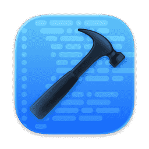

# DevTools

A developer toolkit for the [Construct](https://construct.computer) platform. Provides six commonly-needed utilities through both an MCP server (usable by the AI assistant) and a tabbed GUI.



## Tools

| Tool | Description |
|------|-------------|
| **JSON Formatter** | Format, minify, or validate JSON. Detects structure (object/array), reports key count and minified size. |
| **Base64** | Encode text to Base64 or decode Base64 back to text. Handles UTF-8 correctly. |
| **Hash** | Generate cryptographic hashes (SHA-256, SHA-1, SHA-384, SHA-512) of any text input. |
| **UUID** | Generate v4 UUIDs. Supports batch generation up to 50 at a time. |
| **Timestamp** | Convert between Unix timestamps (seconds or milliseconds) and ISO 8601 dates. Shows UTC, relative time, and both unix formats. |
| **URL Encode** | URL-encode or decode strings. Uses standard `encodeURIComponent` / `decodeURIComponent`. |

## How it works

### Architecture

DevTools is a Construct app that follows the MCP (Model Context Protocol) pattern:

```
┌─────────────┐     stdio      ┌──────────────┐
│  Construct   │ ◄────────────► │  server.ts   │
│  Platform    │  JSON-RPC      │  (Deno)      │
└──────┬──────┘                 └──────────────┘
       │
       │ postMessage
       │
┌──────▼──────┐
│  ui/        │
│  index.html │
│  (iframe)   │
└─────────────┘
```

- **`server.ts`** — An MCP server that runs as a Deno subprocess. It reads JSON-RPC requests from stdin and writes responses to stdout. This is the backend — it exposes all six tools to both the AI assistant and the GUI.

- **`ui/index.html`** — A static HTML interface served in a sandboxed iframe. It communicates with the MCP server through Construct's postMessage bridge (`construct.tools.callText()`). No build step, no framework — just vanilla HTML, CSS, and JavaScript using the Construct SDK.

- **`manifest.json`** — Declares the app's metadata, tools, permissions, UI dimensions, and runtime requirements. The Construct platform reads this to know how to launch and display the app.

### MCP Protocol

Each tool call follows the JSON-RPC 2.0 protocol over stdio:

```json
→ {"jsonrpc":"2.0","id":1,"method":"tools/call","params":{"name":"uuid","arguments":{"count":3}}}
← {"jsonrpc":"2.0","id":1,"result":{"content":[{"type":"text","text":"f47ac10b-58cc...\n550e8400-e29b...\na987fbc9-4bed..."}]}}
```

The AI assistant can call these tools directly in conversation (e.g. "generate 5 UUIDs" or "format this JSON"), and the GUI provides the same tools through a visual interface.

### UI

The GUI uses the Construct SDK (`construct.css` + `construct.js`) for styling and platform integration:

- **Tabbed layout** — Switch between tools without page reloads
- **Copy to clipboard** — One-click copy on every output
- **Theme sync** — Automatically matches the Construct desktop theme (light/dark)
- **Glassmorphism** — Semi-transparent surfaces with backdrop blur, matching the platform aesthetic

## Development

### Prerequisites

- [Deno](https://deno.land/) v2.x

### Running locally

The app is designed to run inside the Construct platform. For standalone testing of the MCP server:

```bash
# Test a tool call
echo '{"jsonrpc":"2.0","id":1,"method":"tools/call","params":{"name":"uuid","arguments":{"count":3}}}' | deno run server.ts
```

### Project structure

```
construct-app-hello-world/
├── manifest.json      # App metadata and tool declarations
├── server.ts          # MCP server (Deno, stdio transport)
├── icon.png           # App icon
├── ui/
│   └── index.html     # Tabbed GUI with all six tools
└── README.md
```

## Credits

- App icon from [macosicons.com](https://macosicons.com/?icon=x3sldgkYgZ)
- Built for the [Construct](https://construct.computer) platform
